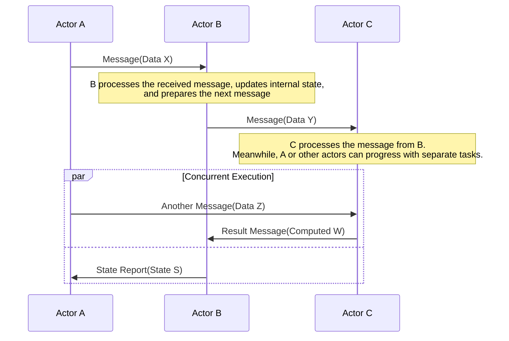

# Phluxor

A toolkit for flexible actor models in PHP, empowering the PHP ecosystem.

requires PHP 8.3 and swoole.

and Protocol Buffers for message serialization. / not supported other serialization formats yet.

Documentation is under preparation.

do not use this in production yet.

[sample web application / phluxor-http-application-samples](https://github.com/ytake/phluxor-http-application-samples)  
[demonstrate the use of Phluxor](https://github.com/ytake/phluxor-example)  
[demonstrates how to use Phluxor with Event Sourcing and CQRS.](https://github.com/ytake/phluxor-example-event-sourcing-cqrs)  
[Documentation](https://phluxor.github.io/en/guide/)

PhluxorはPHPでのアクターモデルを実現するためのツールキットです。    
PHP 8.3 と swooleが必要です。  
メッセージのシリアライズには、Protocol Buffersを利用します。  
他のシリアライズフォーマットはまだサポートされていません。



## Installation

```bash
$ composer require phluxor/phluxor
```

## already implemented

- actor model
- actor lifecycle
- supervision
- actor registry
- actor messaging
- become/unbecome
- mailbox / dispatcher
- event stream
- future
- persistent actors (in memory / mysql)
- [OpenTelemetry](https://opentelemetry.io/docs/languages/php/) support (metrics) 
- router / round-robin, broadcast, scatter-gather, etc.
- [remoting](https://github.com/ytake/phluxor-remote) / Remoting is the mechanism by which Actors on different nodes talk to each other internally.  

## work in progress

- open telemetry support (tracing)
- virtual actors / cluster support

## Supervision

exception handling is done by the actor system, and the actor can be supervised by parent , root actors.

- `OneForOneStrategy`
- `AllForOneStrategy`
- `ExponentialBackoffStrategy`
- `RestartStrategy`

## Easy to use

like a akka http, you can use it with a simple API.  
use mezzio / mezzio-swoole / phluxor.  
and you can use it with swoole / open swoole.

```php
<?php

declare(strict_types=1);

namespace App\ActorSystem;

use App\Message\Add;
use App\Message\Cancel;
use App\Message\Event;
use App\Message\GetEvent;
use Phluxor\ActorSystem\Context\ContextInterface;
use Phluxor\ActorSystem\Message\ActorInterface;

class TicketSeller implements ActorInterface
{
    private int $tickets = 0;
    private string $name = '';
    private string $id   = '';

    public function receive(ContextInterface $context): void
    {
        $msg = $context->message();
        switch (true) {
            case $msg instanceof Add:
                // change actor state
                $this->name    = $msg->name;
                $this->tickets = $msg->tickets;
                $this->id      = $context->self()?->protobufPid()->getId();
                break;
            case $msg instanceof GetEvent:
                $context->requestWithCustomSender(
                    $context->sender(),
                    new Event($this->name, $this->tickets),
                    $context->parent()
                );
                break;
            case $msg instanceof Cancel:
                $context->requestWithCustomSender(
                    $context->sender(),
                    new Cancel(),
                    $context->parent()
                );
                $context->poison($context->self());
                break;
        }
    }
}
```

send message to actor.

```php
<?php

declare(strict_types=1);

namespace App\ActorSystem;

use App\Event\EventCreated;
use App\Message\EventDescription;
use App\Message\EventExists;
use Phluxor\ActorSystem\Context\ContextInterface;
use Phluxor\ActorSystem\Exception\SpawnErrorException;
use Phluxor\ActorSystem\Message\ActorInterface;
use Phluxor\ActorSystem\Props;
use Swoole\Coroutine\WaitGroup;

use function array_merge;
use function sprintf;

class BoxOffice implements ActorInterface
{
    public function receive(ContextInterface $context): void
    {
        $msg = $context->message();
        switch (true) {
            case $msg instanceof EventDescription:
                try {
                    $result = $context->spawnNamed(
                        Props::fromProducer(fn() => new TicketSeller()),
                        $msg->name
                    );
                    $context->send($result->getRef(), new Add($msg->name, $msg->tickets));
                    $context->respond(new EventCreated($msg->name, $msg->tickets));
                } catch (SpawnErrorException $e) {
                    $context->respond(new EventExists());
                }
                break;
            }
        }
    }
}
```

## Become/Unbecome

an actor can change its behavior by `become` and `unbecome` methods.

example:

one, other are the behavior methods.

```php
<?php

declare(strict_types=1);

namespace Acme;

use Phluxor\ActorSystem\Behavior;
use Phluxor\ActorSystem\Context\ContextInterface;
use Phluxor\ActorSystem\Message\ActorInterface;
use Phluxor\ActorSystem\Message\ReceiveFunction;

class EchoSetBehaviorActor implements ActorInterface
{
    private Behavior $behavior;

    public function __construct()
    {
        $this->behavior = new Behavior();
        $this->behavior->become(
            new ReceiveFunction(
                fn(ContextInterface $context) => $this->one($context)
            )
        );
    }

    public function receive(ContextInterface $context): void
    {
        $this->behavior->receive($context);
    }

    public function one(ContextInterface $context): void
    {
        if ($context->message() instanceof BehaviorMessage) {
            $this->behavior->become(
                new ReceiveFunction(
                    fn(ContextInterface $context) => $this->other($context)
                )
            );
        }
    }

    public function other(ContextInterface $context): void
    {
        if ($context->message() instanceof EchoRequest) {
            $context->respond(new EchoResponse());
        }
    }
}
```

```php
<?php

declare(strict_types=1);

use Acme\BehaviorMessage;
use Acme\EchoSetBehaviorActor;
use Acme\EchoRequest;
use Phluxor\ActorSystem;
use Phluxor\ActorSystem\ActorContext;
use Phluxor\ActorSystem\Props;

use function Swoole\Coroutine\go;
use function Swoole\Coroutine\run;

function main(): void 
{
    run(function () {
        $system = ActorSystem::create();
        go(function (ActorSystem $system) {
            $pid = $system->root()->spawn(
                Props::fromProducer(
                    fn() => new EchoSetBehaviorActor()
                )
            );
            $system->root()->send($pid, new BehaviorMessage());
            $future = $system->root()->requestFuture($pid, new EchoRequest(), 1);
            var_dump($future->result());
            $system->root()->stop($pid);
        }, $system);
    });
}

```

## Persistent Actors

パーシステンスアクターは、以前の状態から復元できるアクターです。  
永続化に利用するデータベースは、お使いの環境などに合わせて自由にアダプターを実装することができます。  
デフォルトではインメモリとMySQLが実装されています。  
メッセージのシリアライズには、Protocol Buffersを利用しますので、事前にProtocol Buffersのファイルを用意しておく必要があります。
以下はサンプルのProtocol Buffersファイルです。

persistent actors are actors that can be restored from the previous state.  
you can implement an adapter freely according to your environment for the database used for persistence.    
by default, in-memory and MySQL are implemented.  
Protocol Buffers is used for message serialization, so you need to prepare a Protocol Buffers file in advance.    

for example, the protocol buffers file is like this.

```protobuf
syntax = "proto3";

package Acme.Persistence.ProtoBuf;

option php_namespace = "Acme\\Persistence\\ProtoBuf";
option php_metadata_namespace = "Acme\\Metadata";

message Message {
  string message = 1;
}

message Snapshot {
  string message = 1;
}

```

詳しい永続化の使い方は、永続アクターのサンプルを参照してください。[Persistence / MySQL](example/persistence/SampleSystem.php)  

for example, the persistent actor is like this. [Persistence / MySQL](example/persistence/SampleSystem.php)

use `Phluxor\Persistence\Mixin` trait and implement `Phluxor\Persistence\PersistentInterface`.

```php
<?php

declare(strict_types=1);

namespace Acme\Persistence;

use Phluxor\ActorSystem\Context\ContextInterface;
use Phluxor\ActorSystem\Message\ActorInterface;
use Phluxor\Persistence\Message\RequestSnapshot;
use Phluxor\Persistence\Mixin;
use Phluxor\Persistence\PersistentInterface;
use Acme\Persistence\ProtoBuf\Message;
use Acme\Persistence\ProtoBuf\Snapshot;

class InMemoryTestActor implements ActorInterface, PersistentInterface
{
    use Mixin;

    private string $state = '';

    public function receive(ContextInterface $context): void
    {
        $msg = $context->message();
        switch (true) {
            case $msg instanceof RequestSnapshot:
                $this->persistenceSnapshot(new TestSnapshot(['message' => $this->state]));
                break;
            case $msg instanceof TestSnapshot:
                $this->state = $msg->getMessage();
                break;
            case $msg instanceof TestMessage:
                if (!$this->recovering()) {
                    $this->persistenceReceive($msg);
                }
                $this->state = $msg->getMessage();
                break;
            case $msg instanceof Query:
                $context->respond($this->state);
                break;
        }
    }
}
```

more examples are in the [Persistence Tests](tests/Persistence) directory.
